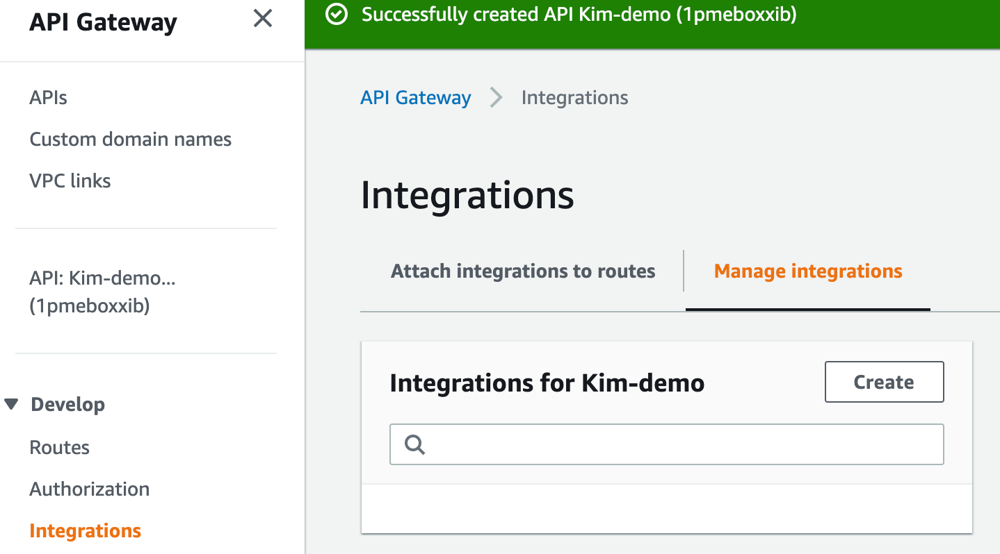
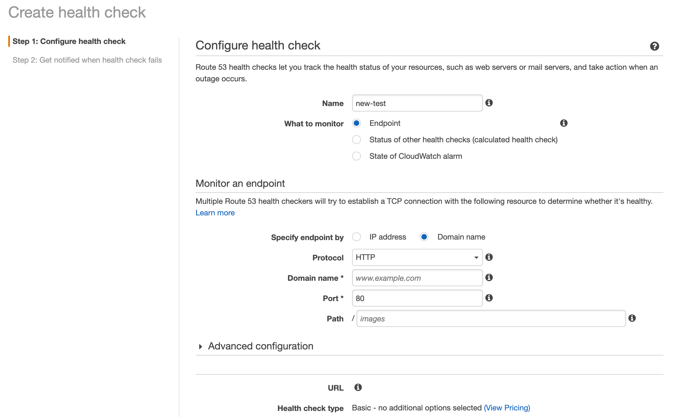

# Building DR site with managed API Gateway


## Name 

**Building DR site with managed API Gateway**

Construct Disaster Recovery mechanism through AWS managed services in multiple Region, way to **mitigate the huge impact of infrastructure failure** against online transaction services.

## Context

**<u>AS-is architecture for commonly used scenario</u>**


* API Gateway services will publish all of the EIP in-used  cidr ranges to public document, the progress is not scheduled.
* The public application load balancer in used is to accept traffic from api gateway only, but still exposed in the public network. which is more challenge to protect business traffics in case there is no WAF, DDoS prevention services integrated.

Customers who are often to use cloudfront and api gateway to boost up transactional api routing and latency, but somehow encountered un-predictable incident due to managed service operation challenge. A classical theme is to leverage API Gateway to serve incoming traffic, then terminate the encrypted traffic data, send the data to backend services which sit behind a public Application Load Balancer. 

To well protect the **public Application Load Balancer**, it is not recommend to allow ip from everywhere to access it, but to allow regional managed APIG IPs in whitelist. As the trendy of API Gateway pattern is hot in diversity industry, there might have a operation time delta in publish the managed APIG IPs range, this result to some APIG IPs are not in the whitelist, so the incoming traffics are blocked out, make huge impact on business.

## Problem

How to make this design more reliable? In the cloud era, to allow/deny communications from distributed computing system by IPs is a challenging task. IPs are always easily be changed and self-governed by each regional gov, telecom ...etc.

How to design a fault-tolerant system to prevent single point of failure?

## Force

When the theme is about service discovering and communication between system nodes, there are always two directions to deal with these issue, 1) client side decide endpoint invocation, 2) server side HA with failover, round-robin strategies ...etc.

Most of customers are restricted in the following forces:

1. Client side application is not capable to make a few change to auto change server-side endpoint connection.
2. Prevent to make widely change on current architecture, especially those components owns responsibilites to handle critical traffics.
3. Constructing DR site is a long-term progress, tend to build it in a single region then cross-region based on clarified RTO/RPO.
4. Seek for least latency to support online. transactional API

## Solutions

To mitigate the issues on api gateway potential operation, we can take 2-steps enhancement practices to build up.

First, consider to migrate the **public application load balancer** into **private application load balancer**.

### Stage -1 Using API Gateway HTTP API private integration with ALB

It's a common misunderstanding that people always think about the application load balancer (ALB) should place it into public subnet, so that the ALB could correctly accept the traffic from client. In fact, the ALB could be placed into private subnet, the ALB will mount ENI and to use the IPs from the private subnet CIDR.

For the API Gateway, it would be great to use HTTP API instead of REST API for the below reasons: 

* For transactional scneario use cases, HTTP API is more cost-effective than REST API if there is no more request/response transformation process( which is a big plus from REST API feature).
* take a reference to check current stack limit if there is any conflict on feature offering : https://docs.aws.amazon.com/zh_tw/apigateway/latest/developerguide/http-api-vs-rest.html

Private integrations enable you to create API integrations with private resources in a VPC, such as Application Load Balancers or Amazon ECS container-based applications.

You can expose your resources in a VPC for access by clients outside of the VPC by using private integrations. You can control access to your API by using any of the [authorization methods](https://docs.aws.amazon.com/apigateway/latest/developerguide/http-api-access-control.html) that API Gateway supports.

To create a private integration, you must first create a VPC link. To learn more about VPC links, see [Working with VPC links for HTTP APIs](https://docs.aws.amazon.com/apigateway/latest/developerguide/http-api-vpc-links.html).

After you’ve created a VPC link, you can set up private integrations that connect to an Application Load Balancer, Network Load Balancer, or resources registered with an AWS Cloud Map service.

To create a private integration, all resources must be owned by the same AWS account (including the load balancer or AWS Cloud Map service, VPC link and HTTP API).

By default, private integration traffic uses the HTTP protocol. You can specify a [`tlsConfig`](https://docs.aws.amazon.com/apigatewayv2/latest/api-reference/apis-apiid-integrations-integrationid.html) if you require private integration traffic to use HTTPS.

#### Instructions

Below instructions provides a demo scenario, so that you can run a nginx server via the purposed architecture.

**<u>1- Create a standard VPC with well designed public/private subnets.</u>**

* 3 AZs in use
* PublicSubnet and PrivateSubnet in used
* Suggest to apply 1 NATGateway for per PublicSubnet
* VPC CIDR : 10.0.0.0/16

Want to simplified these noisy instructions?  Take a look at CDK 

```
export class SecureApiDemoStack extends cdk.Stack {
    constructor(scope: cdk.Construct, id: string, props?: cdk.StackProps) {
        super(scope, id, props);

        // The code that defines your stack goes here

        //classic standard vpc
        const vpc = new ec2.Vpc(this, "MyVpc", {
            maxAzs: 3,
            natGateways: 3,
        });
}


#!/usr/bin/env node
import 'source-map-support/register';
import * as cdk from '@aws-cdk/core';
import {SecureApiDemoStack} from '../lib/secure-api-demo-stack';

const app = new cdk.App();
new SecureApiDemoStack(app, 'SecureApiDemoStack', {

    //env: {account: process.env.CDK_DEFAULT_ACCOUNT, region: process.env.CDK_DEFAULT_REGION},
    env: {account: process.env.CDK_DEFAULT_ACCOUNT, region: 'us-east-2'}


});

```


**<u>2- launch an EC2 instance in private subnet for nginx sample server</u>**

From now on, you could connect an EC2 instance in private subnet through session manager without bastion server.

Suggest to provision an Amazon Lixnux2 server for the experiment.


After success logined EC2, start the nginx installation as usual.

```
#install nginx server
sudo yum install nginx

# start the service
sudo service nginx start

# to check server running status
curl http://127.0.0.1
```


**<u>3- Create an ALB in private subnet</u>**

* Create an internal use ALB
* Listeners keep default ( LoadBalancer protocol - HTTP, Load Balancer Port 80) or modify it as desired configurations
* Availability Zones, choose your VPC and make sure there are only private subnet zones are checked to attach the ENIs for ALB.


* Assign a security group, you could use existing security group to allow traffic or create one to allow traffic from VPC CIDR ranges.
* Configure routing to Target group - **Specify the target type for Instance, protocol stick with HTTP, port 80 as default**. Health checks could use HTTP with context path **/** .
* Register Targets, to check the provisioned EC2, and **Add to registered**, finish the Target group settings.


**<u>4- Create an API Gateway HTTP API</u>**


Specify the API name, and just to skip the integrations, confuyre routes, and use $default stage name for auto deploy mechanism, then create it.


Now, you get the provisioned API : 

* API ID - a 10 digits string to present the API
* Protocol - HTTP
* Created Date
* Description as you comment in
* Default endpoint - enabled


**<u>5- Create Integrations</u>**

Visit left panel to create integrations.




Select the following parameters - 

* Integration type - **Private resource**, this is the way to integrate your backend services.

Integration details - 

* Selection method - **Select manaually**
* Target service - **ALB/NLB**
* Load balancer - **Choose what you have created in the private subnets**
* Listener - **The one associated with your load balancer**


For the Advanced settings, specify **ANY** for invkoe method.

Next, to create a **VPC Link - We need to create a VPC Link for the API Gateway to link to the VPC resources.**


Specify the security group as well, there wil be a default one to go.

Once all of the settings correct, the **VPC Load Balancer** will present on the integrations.

**<u>6- Create route</u>**

Select HTTP method as **ANY**  for context path as root **/**, then create.


**Then, to attach created integration to the API.**


**<u>7- Test APIG</u>**

```
curl https://6i1d3tapke.execute-api.us-east-1.amazonaws.com/
```

There should be a Nginx welcome page. - Welcome to Nginx on Amazon Linux.

#### References

Step by step settings from **aws-samples - https://github.com/aws-samples/aws-apigw-http-api-private--integrations**

Whitepapaer - Best practices for designing Amazon API gateway private APIs and private integration - https://d1.awsstatic.com/whitepapers/private-api-best-practices.pdf


#### Take Away

>  For all of the **API Gateway, ALB** are multiple AZ used infratsructure, and the backend deployed services placed in  multiple AZs as well, the whole system has established a fault-tolerant & auto-healing mechanism to well support transactional services.

If plan to provide  **2 API Gateways** as the origin in single region and expect it could serve the incoming traffic with **FailOver routing policy**, there is a hard-limit from **API Gateway Service**, the API gateway domain name is **regional unique** in each region. 

So, if plan to have dual HA network routing paths in one region, perhaps directly to provide multiple ALBs directly would be an option.  If the API Gateway is an essential component for entire architecture, and would like to build higher grade DR solutions, then to deploy the secondary API in other region should be the one. Please check the **Stage -2 Constructing DR site in another region**.

### Stage -2 Constructing DR site in another region

####  Building DR site across regions

AWS provides multiple AZs infrastructure in each region, when customers tend to build  DR site in 2 or more regions, the overall architecture will rely on Route53 to route traffic with diversity policyies, such as failover policy or latency-based policy. In the POC we will take failover policy to route traffic from primary endpoint to secondary endpoint when the primary endpoint is unhealthy.


Well utilize the AWS Route 53 feature - Faolover policy to route traffics to Primary or Secondary endpoints. This feature will be collaborating with healthy check feature which enabled to check both endpoints healthy status, once the status is unhelathy and reach to the threshold, then Route 53 will resolve the desired domain to be the secondary endpoint.

#### Instructions

**<u>1 - deploy entire architecture in two regions</u>**

Based on stage 1's instruction, you could reproduce the same architecture on second region, make sure the 2nd API gateway test passed.

**<u>2 - Create Health Check for API Gateway</u>**


Visit the Route 53 service, and click the left-top panel link - Health checks, to create desired Health Checks.




It is mandatory to notify SRE, Devops engineer or corelated staeholders to realize there might be APIG service unhealthy, recommend to create Alarms for these unhealthy issue. Therefore to create a new SNS topic or to choose existing one to proceed further notification.


**<u>3 - Create DNS record with FailOver policy</u>**

So far, we should have API Gateway located in 2 region. In order to make these 2 API Gateway as the cloud front distribution origin endpoint, we need to bind custom domain on it.

For this example : 

```
Region : us-east-1
custom domain name created on API Gateway : origin.kimkao.io
bind API Gateway HTTP API : 6xxxxxxxxx( 10 digits)
Generated API Gateway domain name : d-e8y9m4s9gc.execute-api.us-east-1.amazonaws.com
Endpoint tpye : Regional
ACM certification : <<ignore>>


Region : us-east-2
custom domain name created on API Gateway : origin.kimkao.io
bind API Gateway HTTP API : 6xxxxxxxxx( 10 digits)
Generated API Gateway domain name : d-h84of1uo37.execute-api.us-east-2.amazonaws.com
Endpoint tpye : Regional
ACM certification : <<ignore>>

```

**Make sure that you created the same custom domain name on each region API gateway custom domain name, this is to use for failover policy on route 53.**

Next step, create DNS  record with failover policy for API Gateway.

**For us-east-1**

```
record name : origin.kimkao.io
record type : CNAME
value : <Generated API Gateway domain name : d-e8y9m4s9gc.execute-api.us-east-1.amazonaws.com>
routing policy : Failover
Failover record type : Primary
Health check : myapig1
record id : <take what you want but don't duplicate it>
```

**For us-east-2**

```
record name : origin.kimkao.io
record type : CNAME
value : <Generated API Gateway domain name : d-h84of1uo37.execute-api.us-east-2.amazonaws.com>
routing policy : Failover
Failover record type : Secondary
Health check : myapig2
record id : <take what you want but don't duplicate it>
```


**<u>4 - Create CloudFront distribution with Custom domain name</u>**

```
Origin domain name : origin.kimkao.io
alternate Domain names (CNAMEs) : mysecureapi.kimkao.io
```

**Origin settings**


**Behaviors**


**<u>5 - Final Test</u>**

```
curl https://mysecureapi.kimkao.io
```


#### References

Migrate Host zones into AWS Route 53 : https://docs.aws.amazon.com/Route53/latest/DeveloperGuide/migrate-dns-domain-in-use.html

Mkaing Amazon Route 53 the DNS service for an existing domain : https://docs.aws.amazon.com/Route53/latest/DeveloperGuide/MigratingDNS.html


## Resulting Context

DR site construction is a long-term process and there will be more topics to address, such as 

* RTO
* RPO
* Data replication latency requirement
* Encryption key management & replication
* Budgets
* Scope of the DR site, should we need entire DR at second region

Building DR site with AWS managed services is not only focus on the network traffic, routing, storages, the goal for business operation SLA is the only standard to follow, so that you can go on the detail design to fulfill the requirements.

If your domain is hosted in other domain service provider, suggest to migrate to AWS Route 53 to have the failover mechanism to reach the DR goal. Take reference from 

- Making Amazon Route 53 the DNS service for an existing domain - https://docs.aws.amazon.com/Route53/latest/DeveloperGuide/MigratingDNS.html

  > While doing DNS migration, your domain should remain available during the entire migration process. However, in the unlikely event that there are issues, the first option lets you roll back the migration quickly. With the second option, your domain could be unavailable for a couple of days.

- Mirgating DNS domain in use -  https://docs.aws.amazon.com/Route53/latest/DeveloperGuide/migrate-dns-domain-in-use.html.